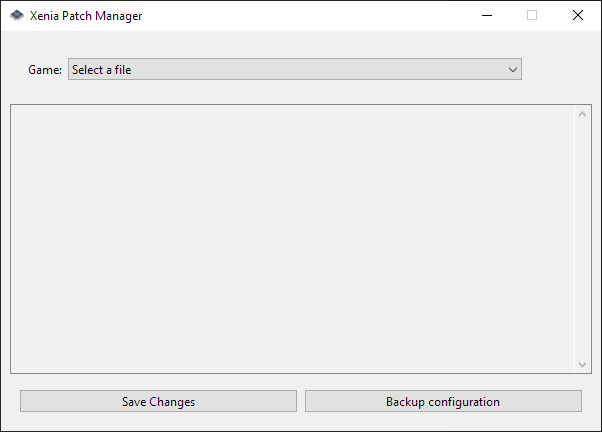
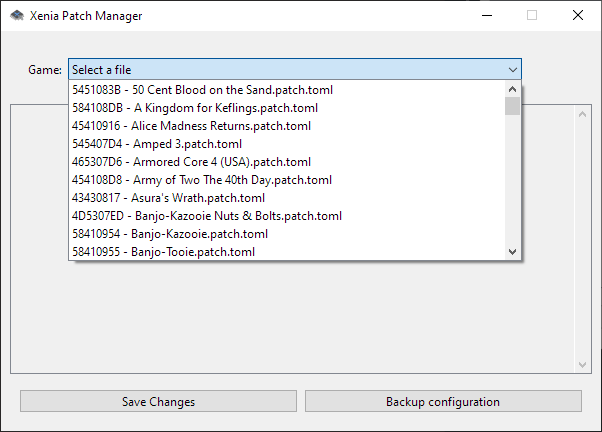
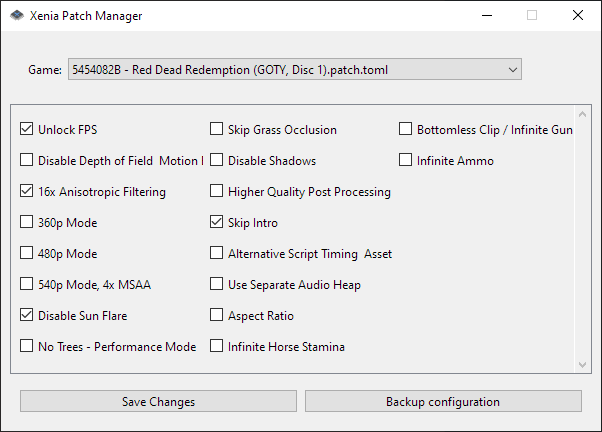

# Xenia Patch Manager

  

A GUI utility that deals with [Xenia Canary's](https://xenia.jp/) cumbersome patch solution

## Features
- Display all the available patches for a game in an intuitive interface
- Easily backup a configuration file

### Patch compatibility
This utility was built using the patches in [this repository](https://github.com/xenia-canary/game-patches) as a template, as such, it may not work properly (if at all) with other files.

## Requirements
In order to use this utility, you'll need:
- [Xenia Canary](https://github.com/xenia-canary/xenia-canary)
- [Python](https://www.python.org/) 3.8 or later
- [PyInstaller](https://pyinstaller.org/en/stable/) for Windows (if building .exe from source)
- A couple of [compatible patch files](https://github.com/xenia-canary/game-patches)

## Installation
You can easily get an executable for Windows from this repo's [***Releases***](https://github.com/catneep/xenia-patch-manager/releases) page.

### Build manually
You can run this utility by using the following commands:

    git clone https://github.com/catneep/xenia-patch-manager
    cd xenia-patch-manager
    . venv/scripts/activate
    pip install -r requirements

### Build executable
Alternatively, you can build an .exe file by running the included ***"build.ps1"*** script from PowerShell (5.1 or later):

    git clone https://github.com/catneep/xenia-patch-manager
    cd xenia-patch-manager
    ./build.ps1

## How to use
After cloning the repository and activating the virtual environment, you can simply run the utility with:

    py main.py path/to/patches

Likewise, you can edit the route to your local patch directory in the file ***"path"*** and run the following command:

    py main.py

Or by editing the ***"path"*** file as stated above and then running the executable from the lastest release.

If it all works out properly, you'll see the following window:

You can then select a file from your locally stored patches in order to display all available options:

You can then save all the changes you've made or backup the current configuration in a *".bak"* file within the same directory.

That's about it, you no longer have to deal with .toml files on your own, enjoy!

## The future
A list of features that I have in mind can be found inside the repo's ***".todo"*** file, so keep an eye out for any new features or bug fixes!